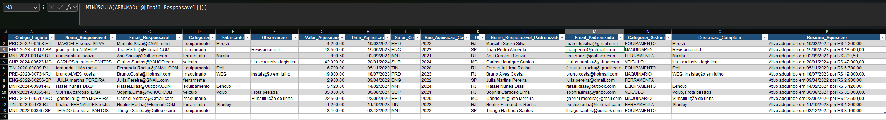

# Module 2 Assessment — ERP Registry Migration

**Module:** 02 — Text Handling & Data Cleaning (Final Assessment)
**Functions combined:** `LEFT`, `MID`, `RIGHT`, `TRIM`, `PROPER`, `LOWER`, `UPPER`, `TEXTJOIN`, `TEXT`

## Task (as received)

> Carlos, IT decided to move up the asset registry migration to the new
> ERP — everything changes, and the deadline that was next week is now
> tomorrow morning. I need you to take this data (which came from 3
> different legacy systems, each with its own mess) and get it ready for
> import.
>
> **Clean and enrich the data:**
> 1. **Setor_Cod, Ano_Aquisicao_Cod, UF** — the legacy code comes in
>    `PPP-AAAA-NNNNN-UF` format. Extract the 3 parts.
> 2. **Nome_Responsavel_Padronizado** — the responsible person's name comes
>    with extra spacing **and** inconsistent casing at the same time. It
>    needs to come out clean **and** in proper-name format in a single
>    formula.
> 3. **Email_Padronizado** — same problem: extra spacing **and** mixed
>    case. Needs to come out clean **and** lowercase.
> 4. **Categoria_Sistema** — category in uppercase, required by the new
>    system.
> 5. **Descricao_Completa** — join Manufacturer and Notes into one
>    sentence, comma-separated. Not every asset has both filled in —
>    handle that.
> 6. **Resumo_Aquisicao** — a ready-to-print label sentence: *"Ativo
>    adquirido em [date] por R$ [value]."* — with value and date formatted
>    as readable text, not a raw number.
>
> No hints on which function to use where — including when more than one
> needs to be combined in the same formula.

## Business context

This assessment combines every function from Module 2 into a single,
unscripted business demand: an accelerated, deadline-driven ERP migration
with data pulled from three different legacy systems, each carrying its own
kind of mess — a fixed-format composite code, inconsistent name casing
stacked with stray whitespace in the same field, optional description
fields, and raw numeric/date values that needed to become readable text.

## Approach

- **LEFT / MID / RIGHT** to split the fixed-format legacy code into sector,
  year, and state.
- **TRIM + PROPER combined** for the responsible person's name, since the
  source data had both extra whitespace and inconsistent casing in the
  same field:
  `=TRIM(PROPER(Ativos[[#This Row],[Nome_Responsavel]]))`
- **LOWER + TRIM combined** for the email, same reasoning:
  `=LOWER(TRIM(Ativos[[#This Row],[Email_Responsavel]]))`
- **UPPER** for the system category code.
- **TEXTJOIN**, with `ignore_empty` set to `TRUE`, to join Manufacturer and
  Notes without leaving a stray separator when one (or both) is blank.
- **TEXT**, combined with `&`, to format the acquisition value and date
  into a printable sentence.

## Result

All 12 rows across the 6 enriched columns validated correctly, including
every edge case (blank optional fields, a source email with trailing
whitespace, and 4-digit year extraction from a fixed-position code).

## Lessons learned

- **`MID`'s length argument must match exactly what's being extracted** —
  grabbing more characters than needed (e.g. length 10 instead of 4) pulls
  in unrelated parts of the string, like a hyphen and the next segment,
  rather than just the intended piece.
- **Real dirty data rarely has just one problem at a time.** The
  responsible-person name and email fields both needed two functions
  nested together (`TRIM` + `PROPER`, `LOWER` + `TRIM`) because the source
  data had both extra whitespace *and* inconsistent casing simultaneously
  — fixing only one of the two issues isn't enough.
- **A bug can hide in plain sight when only some rows are affected.** The
  missing `TRIM` on the email column worked "correctly" for 11 out of 12
  rows purely because those particular source values didn't happen to have
  extra spaces — only checking every row (not just the first one) caught
  it.

  ## Screenshot

