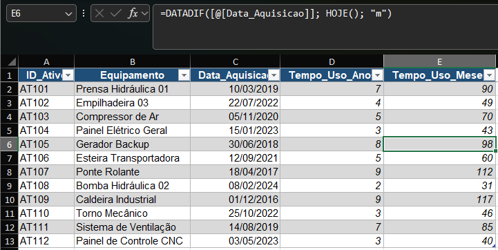

# M3.1 — Asset Warranty Time

**Module:** 03 — Dates
**Functions practiced:** `DATEDIF`

## Task (as received)

> Carlos, good morning. I need to know how long each asset in the warehouse
> has been in use, counting from its acquisition date up to today — in
> **complete years** and also in **complete months**. This will become a
> criterion for deciding which equipment enters the next preventive
> maintenance round.

## Business context

Simulates a maintenance-planning task: calculating elapsed time since
acquisition to help prioritize which assets are due for preventive checks,
based on how long they've been in service.

## Approach

- **DATEDIF** calculates the difference between two dates in a specified
  unit — `"y"` for complete years, `"m"` for complete months:
  `=DATEDIF([@Data_Aquisicao], TODAY(), "y")`
  `=DATEDIF([@Data_Aquisicao], TODAY(), "m")`

## Lessons learned

- `DATEDIF`'s third argument controls the unit of the result — `"y"` for
  complete years, `"m"` for complete months, `"d"` for complete days —
  and it always returns the difference in **complete** units (e.g. "2
  years" means 2 full years have passed, not a rounded value).
- Using `TODAY()` as the end date makes the calculation dynamic: every time
  the sheet is opened, the elapsed time recalculates automatically instead
  of needing to be manually updated with a fixed date.

  ## Screenshot

