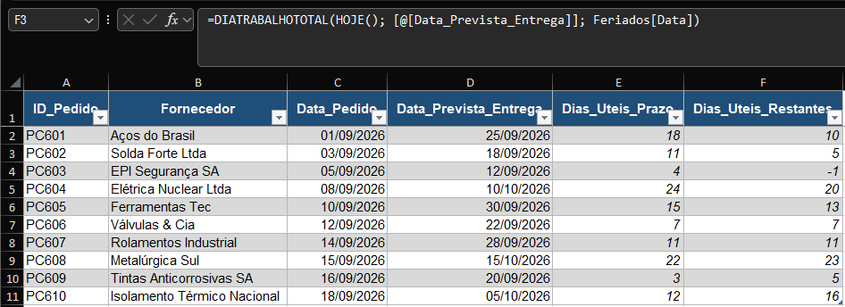

# M3.2 — Real Delivery Deadline in Business Days

**Module:** 03 — Dates
**Functions practiced:** `NETWORKDAYS`

## Task (as received)

> Carlos, good morning. Supply Chain wants to stop counting delivery
> deadlines in "calendar days" — that inflates the real deadline, since
> weekends aren't working days. I need you to calculate each order's
> deadline in **business days**, also accounting for national holidays
> (NUCLEP, being state-owned, closes on those days).
>
> 1. **Dias_Uteis_Prazo** — how many business days exist between
>    Data_Pedido and Data_Prevista_Entrega, **excluding the holidays**
>    listed in the Feriados sheet.
> 2. **Dias_Uteis_Restantes** — how many business days remain **from today**
>    until Data_Prevista_Entrega (also excluding holidays). This will
>    become a visual alert for Supply Chain to know what's tight.

## Business context

Simulates a common SLA-tracking need in supply chain / logistics: raw
calendar-day counts overstate how much working time is actually available,
since weekends (and, for a state-owned company, national holidays) don't
count as productive days.

## Approach

- **NETWORKDAYS** counts business days between two dates, automatically
  excluding weekends, plus any dates passed in as an optional holidays
  argument:
  `=NETWORKDAYS([@Data_Pedido], [@Data_Prevista_Entrega], Feriados[Data])`
- The second formula uses the same function, just swapping the start date
  for `TODAY()`, making it dynamic — it recalculates the remaining days
  every time the sheet is opened:
  `=NETWORKDAYS(TODAY(), [@Data_Prevista_Entrega], Feriados[Data])`

## Lessons learned

- `NETWORKDAYS` excludes weekends automatically — no manual weekday
  checking required — and its optional third argument accepts a full range
  of holiday dates, so any date in that list is skipped too.
- Passing a whole column (`Feriados[Data]`) as the holidays argument means
  new holidays can just be added to that sheet later, and every formula
  using it updates automatically — no need to touch the formulas
  themselves.
- Calendar days and business days answer different business questions:
  calendar days measure elapsed time, business days measure actual
  available working time — using the wrong one understates or overstates
  how tight a deadline really is.

## Screenshot

