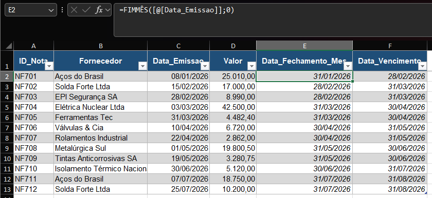

# M3.3 — Accounting Closing and Invoice Due Date

**Module:** 03 — Dates
**Functions practiced:** `EOMONTH`

## Task (as received)

> Carlos, good morning. This is pretty close to what you already do day to
> day with fiscal notes — we need to standardize two reference dates for
> each note entered:
>
> 1. **Data_Fechamento_Mes** — the **last day of the month** in which the
>    note was issued (this defines which accounting closing period it
>    belongs to).
> 2. **Data_Vencimento** — our policy is that due dates always fall on the
>    **last day of the month following** issuance (no matter the exact day
>    the note was issued, the due date always "rounds" to the end of the
>    next month).

## Business context

Simulates a real accounting/fiscal task: assigning standardized period-end
reference dates to invoices — closing period and due date — regardless of
the exact day within the month the invoice was actually issued.

## Approach

- **EOMONTH** returns the last day of the month, a given number of months
  before or after a reference date. Its second argument is how many months
  to shift:
  `=EOMONTH([@Data_Emissao], 0)` → last day of the **same** month as
  issuance.
  `=EOMONTH([@Data_Emissao], 1)` → last day of the **next** month.

## Lessons learned

- `EOMONTH`'s second argument (`months`) controls the offset from the
  reference date's month — `0` stays in the same month, `1` moves one
  month forward, `-1` would move one month back — always landing on that
  month's last calendar day, regardless of how many days that month
  actually has (28, 29, 30, or 31).
- This makes `EOMONTH` the right tool whenever a business rule is stated in
  terms of "end of month" rather than a fixed number of days — a fixed
  "+30 days" rule would land on a different day depending on the month,
  while `EOMONTH` always lands precisely on the last day.

## Screenshot

