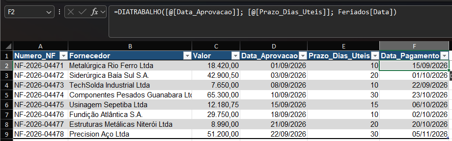

# M3.4 — Payment Term in Business Days

**Module:** 03 — Dates
**Functions practiced:** `WORKDAY`

## Task (as received)

> Carlos, good morning. We've closed the supplier payment-term table with management — each note has a number of business days counted from its approval date, and now we also need to account for national holidays so that no payment falls on a day without business hours.
>
> Calculate `Data_Pagamento` — add the business-day term (`Prazo_Dias_Uteis`) to `Data_Aprovacao`, skipping weekends **and** the holidays listed in the `Feriados` table.

## Business context

Mirrors a real accounts-payable rule: a supplier contract sets payment at "N business days after approval," and a payment can never fall on a weekend or a national holiday, since banks and internal systems (like Sistep) are closed on those days. `WORKDAY` projects a date forward by N *working* days, skipping both weekends and a supplied list of holidays — the mirror image of `NETWORKDAYS` (M3.2), which counts business days *between* two known dates instead of projecting one forward.

## Approach

`WORKDAY` moves a start date forward by a number of working days, skipping weekends and any date listed in its optional third argument:

- `=WORKDAY([@Data_Aprovacao], [@Prazo_Dias_Uteis], Feriados)` → the payment date, weekends and holidays skipped.

`Feriados` is a named range pointing at the `Data` column of the holidays table, so the formula stays readable and keeps working if the holiday list moves.

## Lessons learned

- The `holidays` argument takes a whole range, not a single cell — every date you want skipped has to be listed there.
- Weekends are skipped automatically; only *extra* non-working days (holidays) need to be supplied.
- `WORKDAY` and `NETWORKDAYS` are complementary: one counts business days between two dates, the other projects a date forward by a number of business days.
- Worth checking with a "no holidays" version first (`=WORKDAY([@Data_Aprovacao], [@Prazo_Dias_Uteis])`), then adding the third argument and confirming only the rows near a holiday change — of the 8 invoices here, only 3 (NF-2026-04474, 04477, 04478) shift because of a holiday.

## Screenshot

