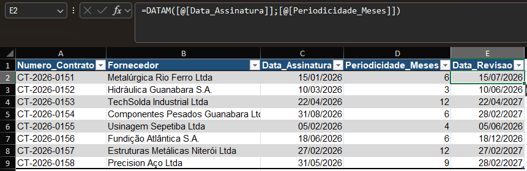

# M3.5 — Contract Review Date

**Module:** 03 — Dates
**Functions practiced:** `EDATE`

## Task (as received)

> Carlos, good morning. Our supply contracts have a periodic review clause — every X months after signing, the contract needs to be reviewed (pricing, delivery terms, etc.), always on the same day of the month as the original signing date.
>
> Calculate `Data_Revisao` — the signing date plus the review interval (`Periodicidade_Meses`), keeping the same day of the month.

## Business context

Simulates a real contract-management task: supplier contracts carry a periodic review clause stated in months, and the review date has to land on the same calendar day each cycle — not a fixed "+180 days" offset, which would drift away from the original day as months of different lengths pass.

## Approach

`EDATE` returns a date a given number of months before or after a reference date, keeping the same day of the month:

- `=EDATE([@Data_Assinatura], [@Periodicidade_Meses])` → the review date, same day, N months later.

## Lessons learned

- `EDATE` is the `EOMONTH` (M3.3) of same-day shifts: `EOMONTH` always lands on the last day of the target month, `EDATE` always tries to land on the *same day number* as the start date.
- When the start day doesn't exist in the target month, `EDATE` falls back to that month's last valid day instead of erroring. Two contracts here show it: both were signed on the 31st, and their review date lands in February 2027 (28 days) — `EDATE` returns 28/02/2027 for both, not an invalid "31/02/2027."
- Because of that fallback, a chain of `EDATE` calls (review → next review → next review) can silently shift the "anniversary day" permanently once it crosses a short month — worth flagging to whoever owns the contract calendar, not just computing and moving on.
- A negative `months` argument works the same way backward — useful for "what was the date 3 months before this one," e.g. reconstructing a previous review date.

## Screenshot

