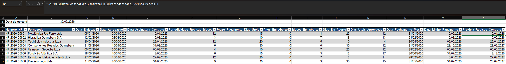

# Final Assessment — Quarter-End Invoice Audit (Module 3: Dates)

**Module:** 03 — Dates
**Functions assessed:** `DATEDIF`, `NETWORKDAYS`, `EOMONTH`, `WORKDAY`, `EDATE` (all of Module 3, combined)

## Task (as received)

> Carlos, bom dia. Fechamento do trimestre — preciso de um raio-x completo da carteira de notas em aberto, com data de corte em 30/09/2026 (coluna `Data_Base`, já fixada na planilha). Pra cada nota, calcule:
>
> 1. **Anos_Em_Aberto**, **Meses_Em_Aberto**, **Dias_Em_Aberto** — há quanto tempo (anos, meses e dias) a nota está em aberto, da emissão até a `Data_Base`.
> 2. **Dias_Uteis_Aprovacao** — quantos dias úteis o processo de aprovação levou, da emissão até a aprovação.
> 3. **Data_Fechamento_Mes** — o fechamento contábil (último dia do mês de emissão).
> 4. **Data_Limite_Pagamento** — o limite de pagamento, contando o prazo em dias úteis a partir da aprovação, descontando os feriados da tabela `Feriados`.
> 5. **Proxima_Revisao_Contrato** — a próxima data de revisão do contrato do fornecedor, a partir da assinatura, considerando a periodicidade em meses.
>
> Dessa vez não vou te passar a fórmula — essa é a avaliação final do módulo de Datas, então é pra você decidir sozinho qual função usar em cada coluna. Já viu todas elas nos exercícios anteriores. Qualquer travamento, me chama, mas tenta resolver sem ajuda primeiro.

## Business context

A quarter-end audit snapshot of open invoices, pulling together every date calculation the finance team runs regularly: aging, approval turnaround, accounting closing, payment deadlines, and contract review scheduling — each one a different "shape" of date problem, which is exactly why Module 3 covered five different functions instead of one.

## Approach

*(held back on purpose — this is the module's closing assessment, no formulas given in advance. Approach and Lessons learned will be filled in once the completed file comes back and is checked.)*

## Screenshot

